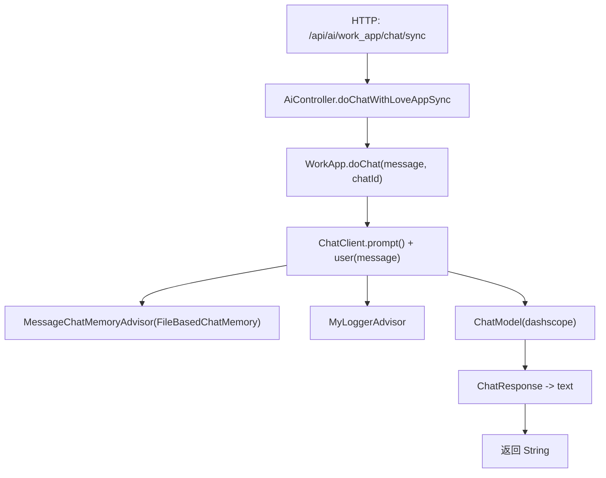
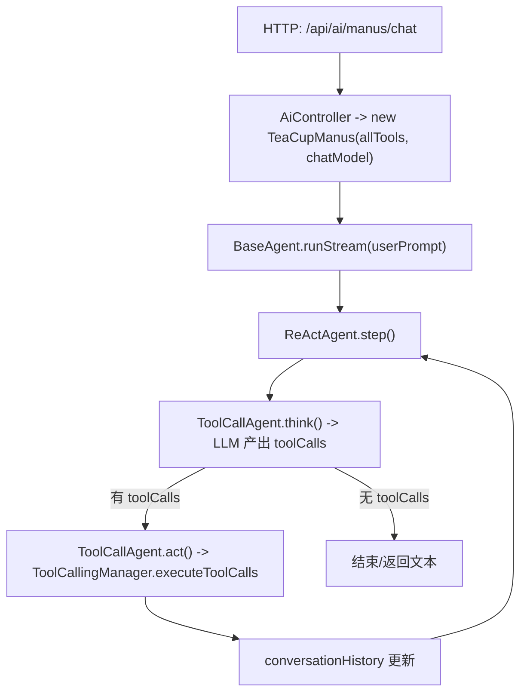

# Teacup AI Agent 项目架构分析 & 重写顺序（精确到 Java 类）

> 目标：为了学习架构，按“可运行的最小闭环 → 逐步加能力”的方式重写；每一步都能启动服务并通过接口验证。

---

## 1. 当前项目架构（按包）

**根入口**
- `com.teacup.teacupaiagent.TeacupAiAgentApplication`：Spring Boot 启动类。

**Web 层**
- `controller/HealthController`：健康检查（最小可用）。
- `controller/AiController`：对外 HTTP API（同步 + SSE/Emitter + Manus Agent SSE）。

**业务应用层（App）**
- `app/WorkApp`：核心应用服务（基于 `ChatClient` 封装了：基础对话 / 流式对话 / RAG 对话 / 工具对话 / MCP 工具对话）。

**Agent 框架层**
- `agent/model/AgentState`：Agent 状态机。
- `agent/BaseAgent`：Agent 执行引擎（同步 `run` + SSE `runStream`），维护 `messageList` 上下文。
- `agent/ReActAgent`：ReAct step 模板（think → act）。
- `agent/ToolCallAgent`：对接 Spring AI 的 Tool Calling（代理调用 + 自维护上下文 + 执行工具）。
- `agent/TeaCupManus`：具体 Agent（配置系统提示词、NextStep 提示词、maxSteps、ChatClient）。

**Advisor（拦截器/切面）**
- `advisor/MyLoggerAdvisor`：记录请求与最终响应（call/stream）。
- `advisor/ReReadingAdvisor`：将用户问题重复一次（增强提示词；当前在 `WorkApp` 未启用）。

**RAG（检索增强）**
- `rag/WorkAppDocumentLoader`：加载 `classpath:documents/*.md` 为 `Document`。
- `rag/WorkAppVectorStoreConfig`：构建 `SimpleVectorStore` 并写入文档 embedding。
- `rag/WorkAppRagCloudAdvisorConfig`：接入 DashScope 云知识库（index=“茶杯图片工坊”）。
- `rag/WorkAppRagCustomAdvisorFactory`：基于 VectorStore 的检索增强 Advisor（topK/threshold + QueryAugmenter）。
- `rag/WorkAppContextualQueryAugmenterFactory`：无上下文时的兜底提示模板。

**ChatMemory（记忆持久化）**
- `chatmemory/FileBasedChatMemory`：用 Kryo 将 `List<Message>` 持久化到 `${user.dir}/tmp/chat-memory/{chatId}.kryo`。

**Tools（工具集）**
- `tools/ToolRegistration`：Spring `@Configuration` 聚合所有工具并输出 `ToolCallback[] allTools` Bean。
- `tools/*Tool`：通过 `@Tool` 暴露可被大模型调用的函数（文件读写/网页搜索/网页抓取/下载/PDF/终止/终端执行等）。
- `constant/FileConstant`：工具保存目录常量 `${user.dir}/tmp`。

**配置**
- `config/CorsConfig`：全局 CORS 放开。
- `application.yml`：DashScope key、embedding/chat model、MCP servers 配置、端口与 swagger。
- `mcp-servers.json`：MCP stdio servers（示例：amap-maps）。

---

## 2. 运行时关键链路（你需要“重写后能复现”的流程）

### 2.1 WorkApp：普通对话链路

关键点：
- `WorkApp` 在构造时用 `ChatClient.builder(ChatModel)` 把 **system prompt**、**advisors** 固化为默认行为。
- `MessageChatMemoryAdvisor` 通过 `CHAT_MEMORY_CONVERSATION_ID_KEY` 把 `chatId` 映射到 `ChatMemory` 文件。

### 2.2 WorkApp：流式对话（SSE/Emitter）

- `AiController` 提供两种 SSE：
  - `produces = text/event-stream` + `Flux<String>`（推荐：纯响应式链路）
  - `SseEmitter`（订阅 Flux 后逐 chunk send）

### 2.3 Manus Agent：ReAct + 工具调用链路

关键点：
- `ToolCallAgent` 通过 `DashScopeChatOptions.withProxyToolCalls(true)` 禁用内置机制，自己维护消息上下文 + 执行工具。
- `TerminateTool.doTerminate()` 被调用时，`ToolCallAgent.act()` 将 Agent 状态置为 `FINISHED`。

### 2.4 RAG：本地向量库 vs 云知识库

- 本地向量库：`WorkAppVectorStoreConfig` -> `SimpleVectorStore` -> `WorkAppDocumentLoader.loadMarkdowns()` -> `add(documents)`。
- 云知识库：`WorkAppRagCloudAdvisorConfig` -> `DashScopeDocumentRetriever(index=茶杯图片工坊)` -> `RetrievalAugmentationAdvisor`。
- `WorkApp.doChatWithRag()` 同时挂载：
  - `workAppRagCloudAdvisor`（云）
  - `WorkAppRagCustomAdvisorFactory`（本地 VectorStore）

---

## 3. 重写策略（按“最小可运行闭环”拆分）

下面的顺序是为了让你**每写完一小段就能跑起来**，并且能从 HTTP → App → AI → 返回值/流式，一路打通。

### 3.1 Phase 0：先跑起来（只要能启动）
1. `TeacupAiAgentApplication`
2. `controller/HealthController`

验证：启动后访问 `/api/health`（或你自己的路径）返回 OK。

### 3.2 Phase 1：WorkApp 最小对话闭环（同步）
3. `advisor/MyLoggerAdvisor`（先不引入别的 Advisor，方便观察请求/响应）
4. `chatmemory/FileBasedChatMemory`（或先用 `InMemoryChatMemory`，但推荐直接对齐当前实现）
5. `app/WorkApp`（只实现 `doChat` + 构造 `ChatClient`）
6. `controller/AiController`（只保留 `/work_app/chat/sync`）

验证：`/api/ai/work_app/chat/sync?message=...&chatId=...` 返回模型文本，并且日志打印 request/response。

### 3.3 Phase 2：流式输出（Flux + SseEmitter 二选一也可）
7. `app/WorkApp`：实现 `doChatByStream`
8. `controller/AiController`：实现 `/work_app/chat/sse`（Flux 版本）
9. `controller/AiController`：实现 `/work_app/chat/sse_emitter`（Emitter 版本，可选）

验证：浏览器/客户端能持续接收 chunk。

### 3.4 Phase 3：工具系统（不引入 Agent，先让 WorkApp 能 tools call）
10. `constant/FileConstant`
11. `tools/FileOperationTool`
12. `tools/ResourceDownloadTool`
13. `tools/WebScrapingTool`
14. `tools/WebSearchTool`
15. `tools/PDFGenerationTool`
16. `tools/TerminateTool`
17. `tools/TerminalOperationTool`（建议顺带把 `cmd.exe` 改成跨平台实现时再写，否则 macOS 上不可用）
18. `tools/ToolRegistration`（输出 `ToolCallback[] allTools` Bean）
19. `app/WorkApp`：实现 `doChatWithTools`

验证：提问触发工具调用（例如“把这段文本写入文件xxx.txt”），并能看到工具执行结果。

### 3.5 Phase 4：Agent 框架（ReAct + 工具自动规划）
20. `agent/model/AgentState`
21. `agent/BaseAgent`
22. `agent/ReActAgent`
23. `agent/ToolCallAgent`
24. `agent/TeaCupManus`
25. `controller/AiController`：实现 `/manus/chat`

验证：给 Manus 一个多步任务（下载网页→抽取→写文件→生成PDF），观察 step-by-step SSE 输出。

### 3.6 Phase 5：RAG（先本地，再云端）
26. `rag/WorkAppDocumentLoader`
27. `rag/WorkAppVectorStoreConfig`
28. `rag/WorkAppContextualQueryAugmenterFactory`
29. `rag/WorkAppRagCustomAdvisorFactory`
30. `app/WorkApp`：实现 `doChatWithRag`（先只挂本地 Advisor）
31. `rag/WorkAppRagCloudAdvisorConfig`（最后接云端知识库，避免一开始就依赖外部配置）

验证：提问能命中 `documents/*.md` 内容；接入云端后，再验证知识库 index 检索。

### 3.7 Phase 6：杂项与完善
32. `advisor/ReReadingAdvisor`（可选：A/B 对比效果）
33. `config/CorsConfig`
34. `demo/invoke/SpringAiAiInvoke`（纯 demo，可最后写）

---

## 4. “从哪个 Java 类开始写”的推荐答案

如果你要**严格按依赖最小化**重写（不希望先被 Spring/AI 配置绊住），建议第一刀从：

1) `com.teacup.teacupaiagent.agent.model.AgentState`  
2) `com.teacup.teacupaiagent.agent.BaseAgent`

原因：这两者不依赖 Spring Bean 装配（除了类型引用），可以用单元测试/纯 Java 先把“step 循环 + 状态机 + SSE 输出骨架”建立起来，后续再把 `ChatClient`、ToolCalling 接进来。

如果你的目标是**最快看到可运行的 HTTP 效果**，建议第一刀从：

1) `com.teacup.teacupaiagent.TeacupAiAgentApplication`  
2) `com.teacup.teacupaiagent.controller.HealthController`  
3) `com.teacup.teacupaiagent.app.WorkApp`

---

## 5. 你重写时最值得“刻意练习”的 5 个点

1. `WorkApp` 里 `ChatClient` 的“默认 system + advisors”如何组织（可配置化 vs 写死常量）。
2. `ChatMemory` 的持久化边界：何时写入、何时读取、maxMessages 是否真正生效（当前实现 `get` 忽略 maxMessages）。
3. Tool 注册与装配方式：现在是手动 new + `ToolCallbacks.from(...)`，你可以重写为 Spring Bean 自动扫描（学习 IOC）。
4. `ToolCallAgent` 为什么要 `withProxyToolCalls(true)`：理解 Spring AI Tool Calling 的消息历史如何维护。
5. RAG 的“本地向量库”和“云知识库”如何切换/并存：建议重写时做成策略可配置（profile/开关）。

